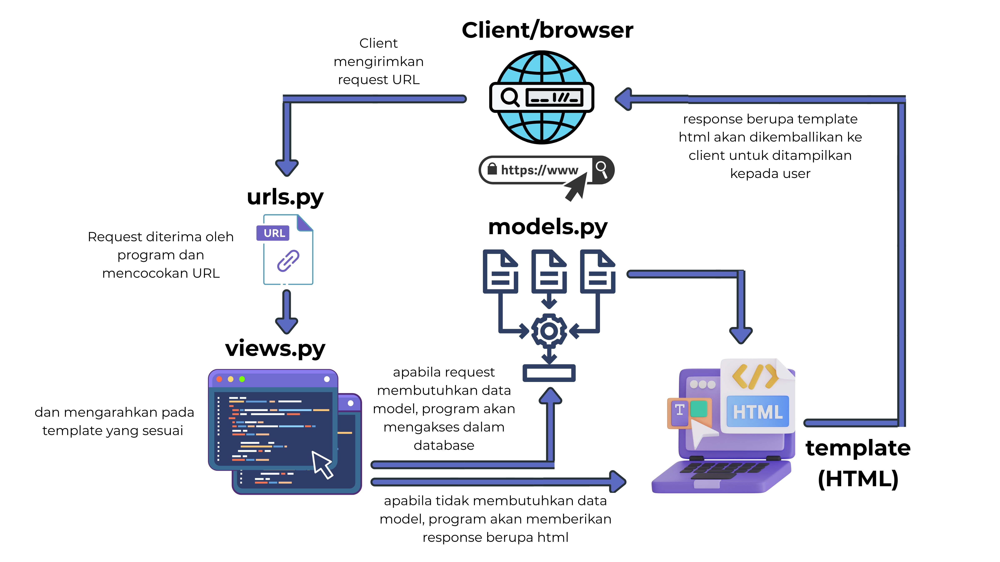

# Tugas 2

### Jelaskan bagaimana cara kamu mengimplementasikan checklist di atas secara step-by-step (bukan hanya sekadar mengikuti tutorial). 

-> Langkah pertama saya membuat repositori GitHub bernama **the-corners**, lalu membuat folder lokal yang dihubungkan ke repositori tersebut. Di dalam folder ini saya mengaktifkan virtual environment, menginstall Django, dan menjalankan **django-admin startproject** untuk membuat project utama. Setelah project berhasil dibuat, saya langsung mendeploy project ke **PWS (Pacil Web Service)** dan menambahkan URL deployment ke dalam ALLOWED_HOSTS di settings.py.

Selanjutnya saya membuat aplikasi baru bernama **main** dan menambahkannya ke **INSTALLED_APPS** pada **settings.py** agar terhubung dengan database. Pada aplikasi ini saya membuat model Product dengan field name, price, description, thumbnail, category, dan is_featured. Kategori produk saya batasi menjadi beberapa pilihan, seperti bola, sepatu, jersey, aksesoris, dan bundle. Setelah mendefinisikan model, saya menjalankan **python manage.py makemigrations** dan **python manage.py migrate** untuk menyimpan perubahan ke database.

Berikutnya, saya membuat fungsi **show_main** di **views.py** yang merender template **main.html**. Template ini menampilkan nama aplikasi, serta identitas diri saya (nama, NPM, dan kelas). Agar halaman ini bisa diakses, saya membuat file **urls.py** di dalam app main untuk memetakan path ke fungsi tersebut, lalu menambahkan routing di **urls.py** project utama. Dengan begitu, setiap request yang masuk ke URL tertentu bisa diarahkan ke view yang sesuai dan ditampilkan melalui template.

Untuk memastikan fungsionalitas berjalan dengan baik, saya menambahkan test.py yang digunakan untuk mengetes apakah URL bisa diakses, apakah view menggunakan template yang benar, apakah object **Product** dapat dibuat dengan atribut yang sesuai, serta apakah field default tersimpan dengan benar.

Setelah semua selesai dan aplikasi berjalan baik secara lokal maupun di PWS, saya melakukan **git add**, **git commit**, dan **git push** ke GitHub dan ke PWS agar project saya terdokumentasi dengan rapi.

### Buatlah bagan yang berisi request client ke web aplikasi berbasis Django beserta responnya dan jelaskan pada bagan tersebut kaitan antara urls.py, views.py, models.py, dan berkas html. 

### Jelaskan peran settings.py dalam proyek Django!
-> setting.py dalam Django berperan sebagai pusat pengaturan project Django. File tersebut berisi seluruh pengaturan utama project, seperti  pengaturan database yang dipakai, daftar aplikasi yang aktif, lokasi template dan file lainnya yang bersifat statis. Selain itu terdapat keamanan berupa secret key, allowed host untuk membatasi akses, dan lain lain.

### Bagaimana cara kerja migrasi database di Django?
-> migrasi dapat dilakukan dengan menjalani kode **makemigrations** dan Django akan membuat file migrasi yang berisi instruksi perubahan, seperti membuat tabel baru, menambah kolom, atau menghapus dan mengubah field pada model. File tersebut dapat dikatakan sebagai **blueprint** pada perubahan database. Selanjutnya Django akan membaca file migrasi tersebut ketika kode **migrate** dijalankan. Setelah dibaca, Django akan langung menerapkannya ke dalam database, sehingga struktur database dapat tetap sinkron dengan model yang telah diubah. Hal ini membuat setiap kali ada perubahan dalam **models.py** perlu dilakukan 2 langkah migrasi tersebut agar database dapat terupdate dengan baik.

### Menurut Anda, dari semua framework yang ada, mengapa framework Django dijadikan permulaan pembelajaran pengembangan perangkat lunak?
-> Menurut saya framework Django dapat dipilih sebagai permulaan pembelajaran karena menggunakan bahasa python yang sudah pernah dipelajari sebelumnya. Selain itu, framework ini juga terstruktur karena terdapat konsep MVT (Model, View, Template) yang mudah dipahami.

### Apakah ada feedback untuk asisten dosen tutorial 1 yang telah kamu kerjakan sebelumnya?
-> Sejauh ini, saya tidak memiliki kendala dalam mengerjakan tutorial. Asisten dosen pun selalu stand by untuk membantu dan menjawab pertanyaan. Dokumen instruksi juga sangat jelas dan mudah dipahami.

# Tugas 3
### Jelaskan mengapa kita memerlukan data delivery dalam pengimplementasian sebuah platform?
-> Data delivery diperlukan agar aplikasi yang dibuat bersifat dinamis. Server bertugas untuk mengirimkan data ke client agar pengguna dapat melihat informasi yang selalu diperbarui. Selain itu, client juga dapat mengirimkan data input dari user ke server untuk disimpan atau diproses. Jika tidak ada data delivery, maka aplikasi hanya menampilkan konten statis yang tidak dapat diubah sesuai kebutuhan pengguna. 

### Menurutmu, mana yang lebih baik antara XML dan JSON? Mengapa JSON lebih populer dibandingkan XML?
-> Menurut saya, JSON lebih baik dibanding XML karena tampilan JSON lebih sederhana, ringkas, mudah dibaca karena menggunakan key dan value. JSON juga terintegrasi langsung JavaScript sehingga sangat mendukung pengembangan aplikasi web modern. XML sintaksnya cenderung lebih panjang dan sulit dibaca, sehingga penggunaannya semakin jarang, hal itu yang menyebabkan JSON lebih populer dibanding XML

### Jelaskan fungsi dari method is_valid() pada form Django dan mengapa kita membutuhkan method tersebut?
-> Method is_valid() berguna untuk memvalidasi data yang dikirimkan melalui form. Django secara otomatis akan memeriksa apakah data tersebut sudah sesuai dengan aturan yang telah ditetapkan. Contohnya seperti terdapat beberapa field yang sifatnya wajib diisi, ada batasan karakter untuk beberapa atau semua field, dan sebagainya. Jika ada data yang tidak sesuai dengan aturan, form akan menampilkan pesan error. Method ini tentunya sangat penting untuk digunakan karena bisa mencegah input data yang tidak sesuai ke dalam database.

### Mengapa kita membutuhkan csrf_token saat membuat form di Django? Apa yang dapat terjadi jika kita tidak menambahkan csrf_token pada form Django? Bagaimana hal tersebut dapat dimanfaatkan oleh penyerang?
-> csrf_token merupakan salah satu fitur keamanan Django untuk mencegah serangan CSRF (Cross-Site Request Forgery). Token tersebut memastikan bahwa data form benar-benar dikirim dari website kita sendiri, bukan dari website lain. Apabila tidak menggunakan csrf_token, orang lain dapat membuat form palsu diluar website yang kita buat dan mengirimkan request berbahaya bagi user yang mengaksesnya.

###  Jelaskan bagaimana cara kamu mengimplementasikan checklist di atas secara step-by-step (bukan hanya sekadar mengikuti tutorial).
Langkah pertama yang saya lakukan adalah membuat file base.html sebagai template dasar yang berisi struktur utama halaman web. base.html tersebut saya tambahkan ke dalam list templates agar Django dapat mengenali semua file html yang ada di dalamnya, sehingga tampilan menjadi lebih konsisten karena memiliki layout atau tampilan dasar yang sudah ditetapkan.

Selanjutnya, saya membuat file forms.py yang berisi ProductForm sebagai form yang menerima input data produk baru. Form tersebut diimport ke dalam views.py dan digunakan pada fungsi create_product untuk menampilkan form serta menyimpan data produk baru ke database. Selanjutnya, membuat fungsi untuk menampilkan detail produk yang terdaftar.

Untuk menampilkan data dalam format lain, saya menambahkan 4 fungsi, yaitu show_xml dan show_json yang berfungsi untuk menampilkan keseluruhan data produk serta show_xml_by_id dan show_json_by_id yang berfungsi untuk menampilkan data salah satu produk berdasarkan id nya.

Agar fungsi tersebut dapat diakses, saya menambahkan routing baru pada urls.py dan membuat button dalam main.html dengan label "Add Product" dan ketika diklik akan redirect ke form untuk menambahkan produk. Saya juga membuat dua file template baru yaitu create_product.html dan product_detail.html untuk menampilkan detail produk tertentu. Selain itu, saya juga menambahkan URL deployment ke dalam CSRF_TRUSTED_ORIGINS di settings.py agar form dapat berjalan dengan baik pada saat project sedang dijalankan di PWS. Dengan melakukan konfigurasi tersebut, request yang dikirim melalui form tetap dianggap aman oleh Django.

### Apakah ada feedback untuk asdos di tutorial 2 yang sudah kalian kerjakan?

### Mengakses keempat URL di poin 2 menggunakan Postman, membuat screenshot dari hasil akses URL pada Postman, dan menambahkannya ke dalam README.md.
XML

JSON

XML by id product
 
JSON by id product

